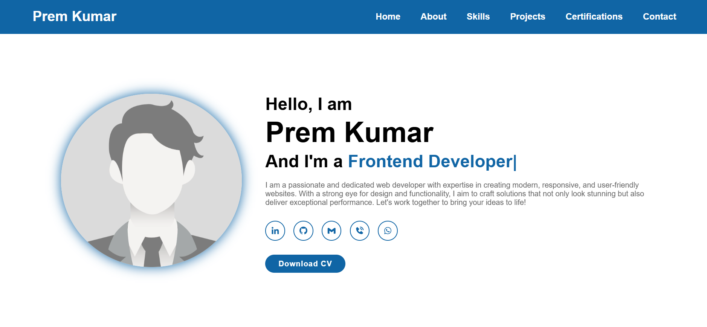

# Portfolio Website

Welcome to my personal portfolio! This website is designed to showcase my skills and projects as a Web Developer. I have built this portfolio to present my work to potential employers as part of my job search.

## 🎨 Demo Screenshot

## 🔗 Live Demo

Check out my Portfolio live here: **[Portfolio](https://premkrrajbhar.github.io/Prem-Kumar/)**

## 🚀 Features

- **Responsive Design**: Seamlessly adapts to various screen sizes for a user-friendly experience.
- **Interactive Navbar**: Mobile-friendly with a smooth toggle effect for easy navigation.
- **Project Showcase**: Displays key projects, skills and experience.

## 🛠️ Technologies Used

- **HTML5** and **CSS3** for structure and styling.
- **JavaScript** for interactivity.

## 📞 Contact

I’m currently seeking job opportunities, and I would love to connect with potential employers or collaborators:

- **LinkedIn**: [premkrrajbhar](https://linkedin.com/in/premkrrajbhar)
- **Email**: [premkumarrajbhar22@gmail.com](mailto:premkumarrajbhar22@gmail.com)
- **GitHub**: [premkrrajbhar](https://github.com/premkrrajbhar)

Thank you for viewing my portfolio!
